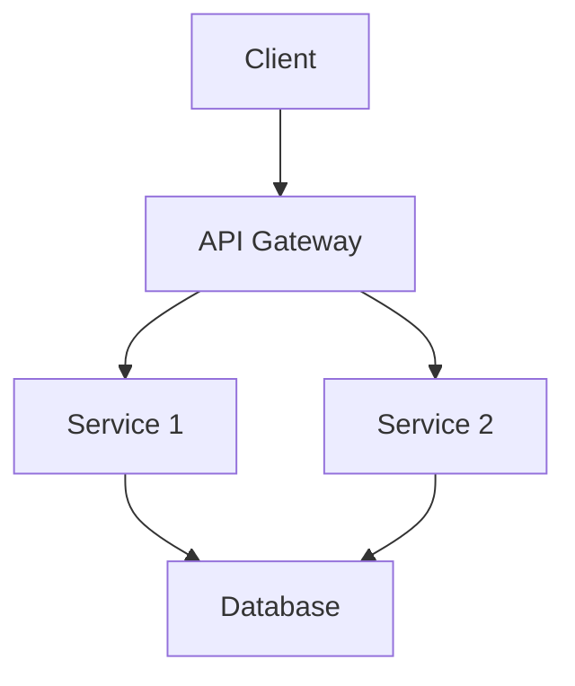
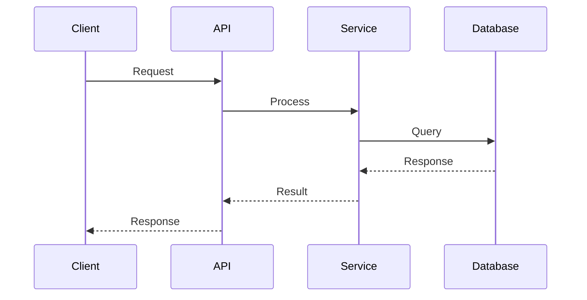

# Architecture Document Template

**Template for documenting system architecture and design decisions**

---

## Document Information

**Title:** System/Component Name Architecture  
**Version:** `1.0`  
**Date:** `YYYY-MM-DD`  
**Author(s):** `Author Name(s)`  
**Status:** `Draft | Review | Approved | Deprecated`  
**Reviewers:** `Reviewer Name(s)`

## Executive Summary

Brief overview of the system/component and its purpose (2-3 sentences).

## Table of Contents

1. [Overview](#overview)
2. [System Context](#system-context)
3. [Architecture Overview](#architecture-overview)
4. [Components](#components)
5. [Data Flow](#data-flow)
6. [Technology Stack](#technology-stack)
7. [Non-Functional Requirements](#non-functional-requirements)
8. [Security Considerations](#security-considerations)
9. [Scalability & Performance](#scalability--performance)
10. [Deployment Architecture](#deployment-architecture)
11. [Future Considerations](#future-considerations)

## Overview

### Purpose

Describe the purpose and goals of this system/component.

### Scope

Define what is included and excluded from this architecture document.

### Assumptions

List any assumptions made during the design process.

## System Context

### System Boundaries

Describe what is included in this system and what interfaces with it.

### External Dependencies

List external systems, services, or components this system depends on.

### User Personas

Describe the primary users and their needs.

## Architecture Overview

### High-Level Architecture

Provide a high-level diagram or description of the system architecture.

### Design Principles

List the key design principles followed:

- Principle 1: Description
- Principle 2: Description
- Principle 3: Description

## Components

### Component 1

**Purpose:** Description of component purpose

**Responsibilities:**
- Responsibility 1
- Responsibility 2

**Interfaces:**
- Interface description

**Dependencies:**
- Dependency 1
- Dependency 2

### Component 2

[Repeat structure for each component]

## Data Flow

### Request Flow

Describe how data flows through the system for typical operations.

## Technology Stack

### Frontend

- Technology 1: Version, Purpose
- Technology 2: Version, Purpose

### Backend

- Technology 1: Version, Purpose
- Technology 2: Version, Purpose

### Infrastructure

- Technology 1: Version, Purpose
- Technology 2: Version, Purpose

### Databases

- Database 1: Type, Purpose
- Database 2: Type, Purpose

## Non-Functional Requirements

### Performance

- Response time requirements
- Throughput requirements
- Resource utilization targets

### Availability

- Uptime requirements
- Disaster recovery plans
- Backup strategies

### Scalability

- Expected load
- Scaling strategies
- Capacity planning

## Security Considerations

### Authentication & Authorization

Describe authentication and authorization mechanisms.

### Data Protection

- Encryption at rest
- Encryption in transit
- Data privacy measures

### Security Best Practices

- Security measures implemented
- Compliance requirements

## Scalability & Performance

### Current Capacity

Describe current system capacity and performance metrics.

### Scaling Strategy

- Horizontal scaling approach
- Vertical scaling approach
- Auto-scaling configuration

### Performance Optimization

- Caching strategies
- Database optimization
- CDN usage

## Deployment Architecture

### Environments

- Development
- Staging
- Production

### Infrastructure

Describe the infrastructure setup (cloud, on-premise, hybrid).

### CI/CD Pipeline

Brief description of deployment pipeline.

## Future Considerations

### Planned Enhancements

- Enhancement 1
- Enhancement 2

### Technical Debt

- Known issues
- Areas for improvement

### Migration Paths

If applicable, describe migration strategies.

## Related Documentation

- [API Documentation](../api/)
- [Deployment Guide](../deployment/)
- [Decision Records](../decision-making/)

## Appendix

### Glossary

| Term | Definition |
|------|------------|
| Term 1 | Definition |
| Term 2 | Definition |

### References

- Reference 1
- Reference 2

---

**Template Instructions:**
1. Remove sections that don't apply to your system
2. Add diagrams using Mermaid or include image references
3. Update all placeholder content
4. Include actual technology versions and details
5. Add links to related documentation
