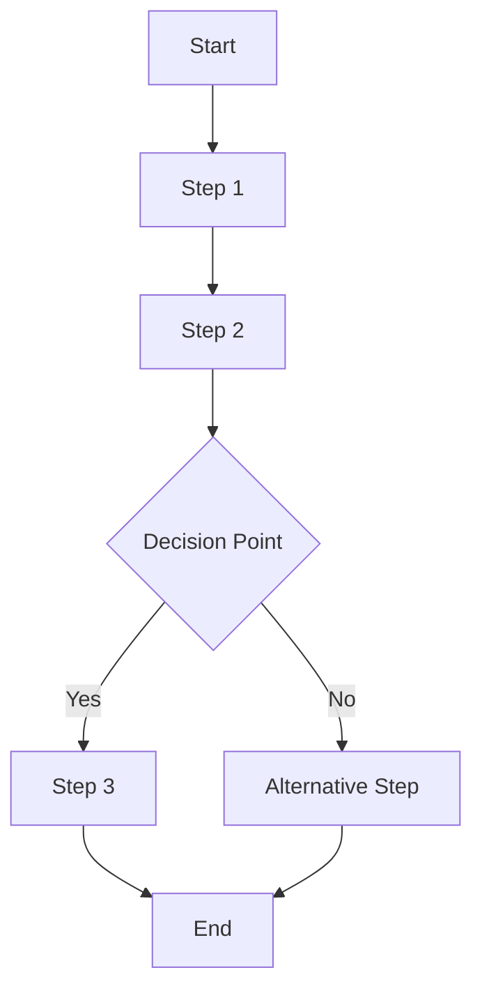

# Process Documentation Template

**Template for documenting workflows and procedures**

---

## Process: [Process Name]

**Last Updated:** `YYYY-MM-DD`  
**Owner:** `Team/Person Name`  
**Status:** `Active | Deprecated | Under Review`  
**Version:** `1.0`

## Overview

Brief description of what this process accomplishes and why it exists.

### Purpose

- Purpose 1
- Purpose 2
- Purpose 3

### Scope

What is included and excluded from this process.

### Stakeholders

- Stakeholder 1: Role and responsibility
- Stakeholder 2: Role and responsibility

## Process Flow

## Detailed Steps

### Step 1: [Step Name]

**Description:** What this step accomplishes.

**Who:** Role or person responsible

**Actions:**
1. Action 1
2. Action 2
3. Action 3

**Inputs:**
- Input 1
- Input 2

**Outputs:**
- Output 1
- Output 2

**Tools/Resources:**
- Tool 1
- Resource 1

**Time Estimate:** X minutes/hours

### Step 2: [Step Name]

[Repeat structure for each step]

## Decision Points

### Decision Point 1: [Decision Name]

**When:** When this decision is needed

**Options:**
- Option 1: When to choose this
- Option 2: When to choose this

**Criteria:**
- Criterion 1
- Criterion 2

## Roles & Responsibilities

| Role | Responsibility |
|------|----------------|
| Role 1 | Responsibility description |
| Role 2 | Responsibility description |

## Tools & Resources

- **Tool 1:** Purpose and link
- **Tool 2:** Purpose and link
- **Resource 1:** Description and link

## Exceptions & Edge Cases

### Exception 1: [Exception Name]

**When it occurs:** Description

**How to handle:**
1. Step 1
2. Step 2

### Exception 2: [Exception Name]

[Repeat structure for each exception]

## Success Criteria

- Criterion 1
- Criterion 2
- Criterion 3

## Metrics & KPIs

- Metric 1: Target value
- Metric 2: Target value

## Related Processes

- [Related Process 1](./related-process-1.md)
- [Related Process 2](./related-process-2.md)

## Change Log

| Date | Version | Changes | Author |
|------|---------|--------|--------|
| YYYY-MM-DD | 1.0 | Initial version | Name |

---

**Template Instructions:**
1. Document each step clearly
2. Include decision points and criteria
3. Define roles and responsibilities
4. Add flowcharts or diagrams
5. Keep process documentation updated
